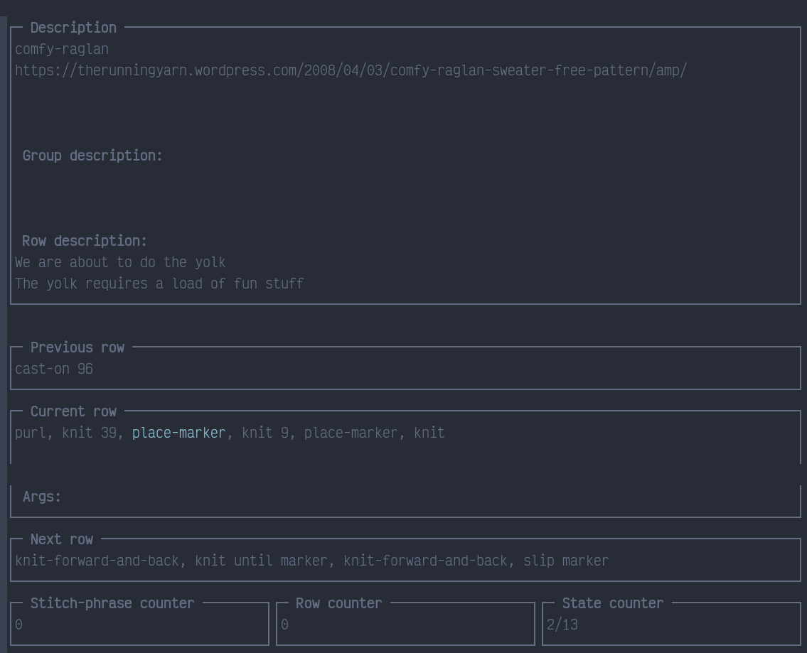

<!-- markdownlint-disable MD013 MD033 -->

# Knit and Go

1. [What and Why](#what-and-why)
2. [How to Download and Run](#how-to-download-and-run)
3. [How to use](#how-to-use)
   1. [Inputs and Outputs](#inputs-and-outputs)
   2. [The TUI](#the-tui)
   3. [CLI Options](#cli-options)
4. [Knit Language Specification](#knit-language-specification)
   1. [Aliases](#aliases)
   2. [Assignments](#assignments)
   3. [Rows](#rows)
   4. [Groups](#groups)
   5. [Comments](#comments)

## What and Why

I took up knitting around Christmas-time (2020) and really took to it quite quickly. Now, any time I'm not spending on one of the machines in front of me as I type, I am knitting something.

One issue that I had fairly frequently to begin with, and though it's no longer an issue it is still an annoyance, is the wording of knitting patterns.

I _can_ read them quite happily, but I often finding myself re-writing them in a sort of shorthand, the shorthand which inspired this project.

As an example, you may find this in a regular ol' knitting pattern

<p align="center"><em>Now that we've reached the eighth row, you'll find that although the pattern for the previous rows has been mainly knit stitches, you'll find that this row has many more purl stitches - though this may not be clear as to the "why" of the matter it will soon become apparent, you'll see the pattern unfold as we continue through the pattern and the bumps will make themselves clear; ergo, we will purl the next two stitches and continue with the knit we had before until the twelve stitch of this particular row</em></p>

and by this, they mean...

<p align="center"><em>purl two</em></p>

which can be condensed to `p(2)` in my mind.

Clearly this is a bit of an exaggeration, but the principle applies far and wide: an 8-point-font block of text taking up half the page is not clear for anyone, surely... I guess it may just be me... but then again I wrote this project for me... so I'm happy either way.

## How to Download and Run

This requires a couple of things. I'm hoping (if anyone has any sort of interest in the project) to make this more accessible, i.e. compiled to a native Windows binary, point and click kind of thing (assuming [termui](https://github.com/gizak/termui) works on Windows).

But as it stands, [`git`](https://git-scm.com/) and [Golang](https://golang.org/) are required, one is used to get a copy of the code and the other is used to compile and run it respectively.

As it stands:

```bash
git clone https://github.com/BodneyC/knit-and-go.git
cd knit-and-go
go run ./main.go ./test-patterns/rsc/simple.knit
```

or,

```bash
go install github.com/BodneyC/knit-and-go
knit-and-go ./test-patterns/rsc/simple.knit
```

With the last phrase being whatever other pattern file you wish to use (there are some examples in `./test-patterns`).

## How to Use

There are a few different components to this software, this section hopes to elucidate on these different bits.

### Inputs and Outputs

The best way to understand Knit and Go is to look at the input and output formats.

#### Knit

The standard input to the program is the `.knit` file format, this is described below in the [Knit Language Specification](#knit-language-specification).

No `--inform` option need to passed if you are passing in a `knit` file.

#### AST

`knit` files are then parsed and an AST is formed. By passing the `--ast` option followed by a filepath, this ast will be marshalled to JSON and written to the given file.

If you wish to edit the AST directly and pass the edited version back to the program, you should pass `--inform ast` along with the input AST file.

As this file is a JSON file, the expected suffix is `.json`. However, for a little extra detail I've been using `<name of pattern>.ast.json` but this (and extensions in general) are optional.

#### States

Once the AST is formed, the states of the program are formed, these are equivalent to the "pages" of the user interface (see [The TUI](#the-tui)).

There are a number of reasons you may wish to write these states to disk, the main one being that if you're part way through a program's run and you have counters set in each page and you want to return to this later, then you need some way to remember this.

If you're passing in a `knit` or an AST and wish to save the states, pass the `--states` option followed by a filepath.

If you failed to pass the `--states` option but have been working through a pattern and wish to save your progress, pressing `ctrl+s` in the TUI will create a temporary file for you to use, please see the logs of the program for the filename.

#### Multiple Input Sources

This is only available for the `knit` inform.

If you have a `.knit` file with all of your common aliases and assignments and don't want to copy and paste them all at the top of a particular pattern you're writing, then you can specify multiple input files.

Say you have aliases in `./test-patterns/multi-input/aliases.knit` and a pattern in `./test-patterns/multi-input/pattern.knit`, you could run:

```bash
go run ./main.go ./test-patterns/multi-input/{aliases,pattern}.knit
```

which would run both files through the lexer/parser in the order provided, taking the top comment of the last input as the program's "block comment".

### The TUI



| Key  | Action                                   |
| :--  | :--                                      |
| `q`  | Quit the TUI                             |
| `j`  | Move to the next state (row)             |
| `k`  | Move to the previous state (row)         |
| `l`  | Move right across the row definition     |
| `h`  | Move left across the row definition      |
| `s`  | Increase the stitch counter              |
| `S`  | Decrement the stitch counter             |
| `r`  | Increase the row counter                 |
| `R`  | Decrement the row counter                |
| `x`  | Reset the row and stitch counters (to 0) |
| `^s` | Save to the `states` file or a temp file |

### CLI Options

There are a number of flags which can be used, these can be revealed with the `--help` option, for example:

```bash
$ go run ./main.go --help
NAME:
   Knit and Go - Run a knitting pattern in a TUI

USAGE:
   main [global options] command [command options] [arguments...]

COMMANDS:
   help, h  Shows a list of commands or help for one command

GLOBAL OPTIONS:
   --inform value, --inf value    Input file format (default: "knit")
   --ast value                    Write parsed .knit to this file as JSON
   --states value                 Write knit program states to this file as JSON
   --no-run, --norun              Prevent the program from running the pattern (default: false)
   --log-level value, --ll value  Log level (error, info, debug, trace, etc.)
   --timer                        Log time since start of program (default: false)
   --help, -h                     show help (default: false)
```

Generally speaking, you'll want: `go run ./main.go <input file>`

If, however, you want to store the AST, edit it, and read it in again later, you could use:

```bash
go run ./main.go --ast <output file> <input file>
# edit the output file
go run ./main.go --inform ast <output file>
```

and this will run the AST JSON in a little TUI.

## Knit Language Specification

This is far more "loose" a language than I am used to working with, for the computer-folks out there, no identifiers need to be defined and things that would work as functions to knitters may not require any specification.

For example, I could write `stockinette(2")` and knitters would know to continue in [Stockinette](https://www.thesprucecrafts.com/learning-the-stockinette-stitch-2116122) stitch for two inches or so... in the "code" `stockinette` does not need definition and writing a compiler around identifier that could be single stitches, functions, sub-patterns, etc. was quite the challenge.

Hopefully this specification will explain things a little.

### Aliases

Most knitting-pattern-writers will have a list of their shorthands for particular stitches, for example "'k' is 'knit'" is a very common one; in the `knit` language this would be:

```knit
k := knit
```

From that, we can gather that the `:=` operator is used to describe an alias, i.e. a word that is used to describe another word.

Once point of note is that the right hand side (RHS) of an assignment cannot contain spaces, so if you want to describe a "kfb", you could write:

```knit
kfb := knit-front-and-back
```

but not:

```knit
kfb := knit front and back
```

this would be a syntax error.

### Assignments

If you want something more than a string (e.g. "k") to string (e.g. "knit") alias, you probably want an assignment. This is like a function for computer-folks.

Take that Stockinette example from before, most knitters will know this, but you could define a Stockinette stitch as:

```knit
stockinette = {
  k(*)
  p(*)
}
```

i.e. to knit a row and then purl the next (where the asterisk `*` means "to the end of the row"). This could then be called as:

```knit
stockinette(5)
```

in your pattern, implying you should knit a row then purl a row, five times.

### Rows

The main thing you'll want to define is a row (or a round) and the mix of stitches within this row (or round).

A row takes a single line, that is to say that no newline (the `enter` key) is present before the end of the row.

Say you have a simple checkered pattern, two squares along the row, you could write:

```knit
k(12) p(12)
```

which would mean knit twelve then purl twelve for a total row length of twenty-four stitches. And that's the full row.

If you want more than two squares along the row-line, you can just repeat that with a brace-group:

```knit
{ k(12) p(12) }(6)
```

So, the braces (`{}`) group the knits then purls, and the parentheses at the end indicate how many times you should repeat this; in this example we have twelve squares, 144 stitches for the row.

### Groups

We've already seen groups to be honest, looking back at [Assignments](#assignments) we have a name, followed by an equals sign (`=`) followed by a brace group that spans multiple lines... and that's all a group is... a set of rows.

Say you have these two rows:

```knit
k(3) p(2) k p k
p(3) k(2) p k p
```

and this is something you don't use again in the pattern but right here, right now, you need this pattern sixteen times and don't want to copy-paste the two lines sixteen times - you could instead write:

```knit
{
  k(3) p(2) k p k
  p(3) k(2) p k p
}(16)
```

So, much like the single row, we group these rows with braces __with newlines__; the parentheses indicate that we repeat sixteen times.

### Comments

Comments are quite important to any pattern, being able to provide that extra bit of information if the knitter is lost is a wonderful thing - in fact, the very purpose of this project, the redundancy, has come in for the save of more than one occasion for me.

Having said that, the comments should be more "optional" than they are in most patterns.

Comments in `knit` begin with a semi-colon (`;`) and last until the end of the line. They cannot be broken once started, so say you have:

```knit
k p k
```

and you want to inform the user of the pattern that this will contribute to the pattern of the finished piece, you ___might___ write:

```knit
; This will contribute to the final pattern k p k
```

... but this will be lost as the `k p k` is on the same line as the comment, what you're after is:

```knit
; This will contribute to the final pattern
k p k
```

and the comment __before__ the row will be added as the "row comment" when parsed by the program.

If you want multiple lines of comments, perhaps to signify the source of the pattern and a personal note, you can simple use contiguous semi-colons, e.g.:

```knit
; I got this pattern from:
;   http://knitting.com/my-pattern
;
; And we'll use this to......
```

That will then be added as a single comment attached to the closest row.
